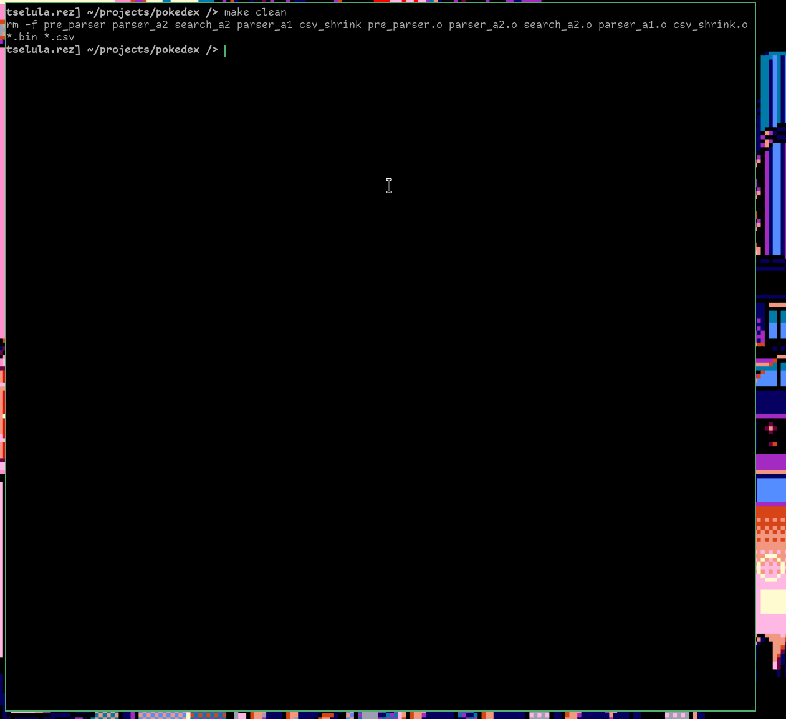

to generate files necessary for a1/ a2, call ./pre_parser. it will read through every file in data, downloading jsons for the pokemon, and creating ability.bin with them. then it creates abilities.csv and pokemon.csv. if you want to change the pokemon that are used, remove the ascii art, as this is the root of all the data. also remove the corresponding .csvs.   

to create an additional input, for the lowest id pokemon (useful for finding the pokemon from the first game, or couple games only) use ./csv_shrink pokemon.csv new_csv.csv max_id_as_number

./parser_a1 is intended to be an initial assignment. It simply reads the .csv and outputs each pokemon.
./parser_a2 is a pt1 of a later assignment. it parsers the .csv and generates more efficient binaries.
./search_a2 uses those binaries to complete searches. 0 to disable ascii art. 1 to enable art. 
